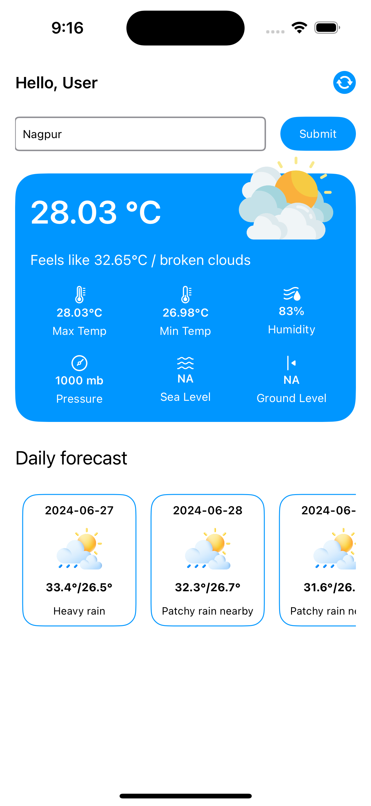
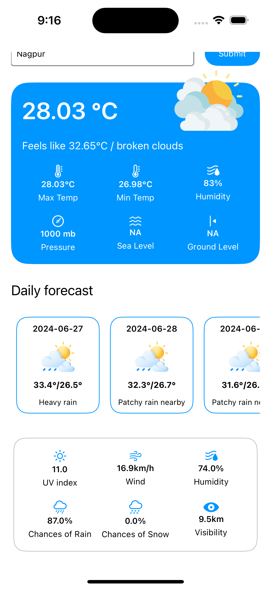
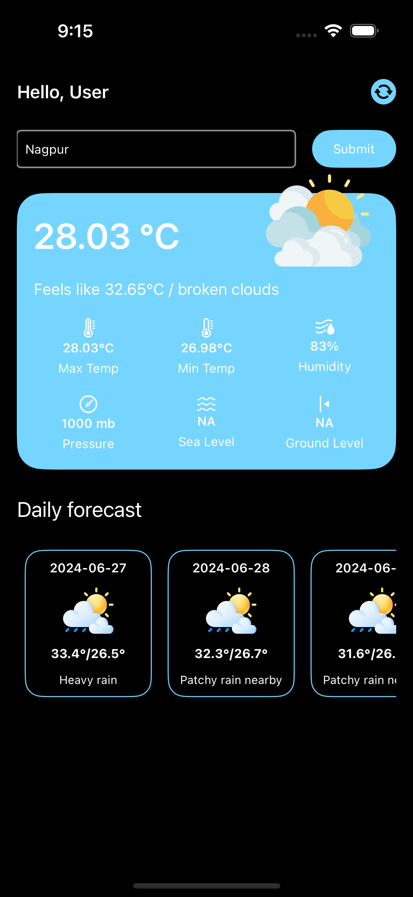
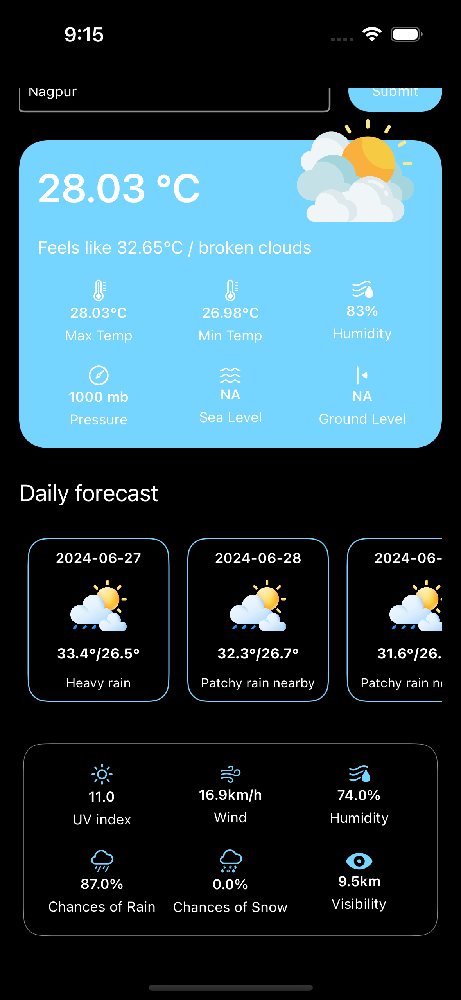

# WeatherApp
WeatherApp is a sleek and user-friendly weather application that provides real-time weather data and a detailed daywise forecast.This Application is written in SwiftUI.

## Features
1. Current Weather Data : Get up-to-date information on temperature, humidity, pressure, sea level and ground level for the location you have searched for.
2. Daywise Forecast : View a detailed weather forecast for the upcoming 10 days, including temperature highs and lows, weather condition, UV index, wind speed, humidity, chances of rain, chances of snow and visibility.
3. Location search : Search for daywise forecast data by location name.
4. Refresh Data : Refresh current weather data and daywise forecast data by clicking on refresh icon at the top.
5. Dark Mode Support : App is Compatible with Dark mode appearance.

## Tech stack
### SwiftUI
In WeatherApp, SwiftUI was used to:
- Build the User Interface: All views and components were created using SwiftUI’s declarative syntax. This allowed for a clean and maintainable codebase.
- Manage UI State: Leveraged SwiftUI's state management to dynamically update the UI based on user interactions and data changes.

### Alamofire
- Fetch Weather Data: Handle all network requests to the weather API to retrieve current weather data and forecasts.
- Parse JSON Responses: Easily parse JSON responses from the API into Swift structs.

### Combine
Combine was used to:
- Manage Data Streams: Use publishers and subscribers to handle data streams from network requests and user inputs.

## How to Run Application?
1. Clone project from github repository, install pod using 'pod install' command.
2. Run the application on any simulator with iOS version 17.5 or higher.
3. You can enter the location for which you want to see weather data and then click on submit , it will fetch new data.
4. Detailed forecast for any day from daywise forecast section can be seen by clicking on Card of any daywise data.
5. You can refresh the screen data using refresh icon at the top.

## Screenshots

  
  

  
  

